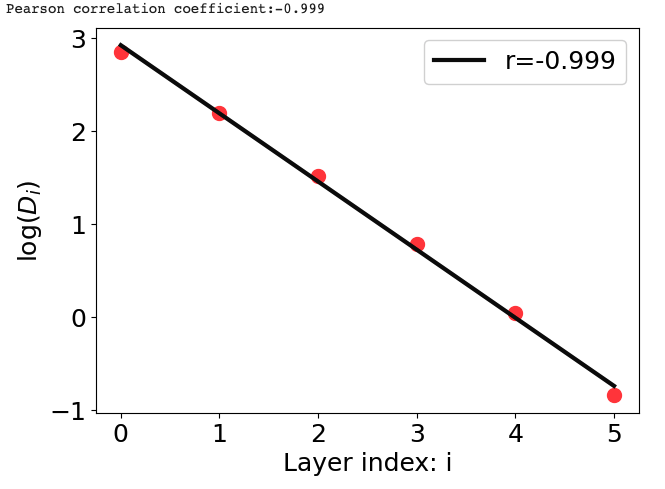
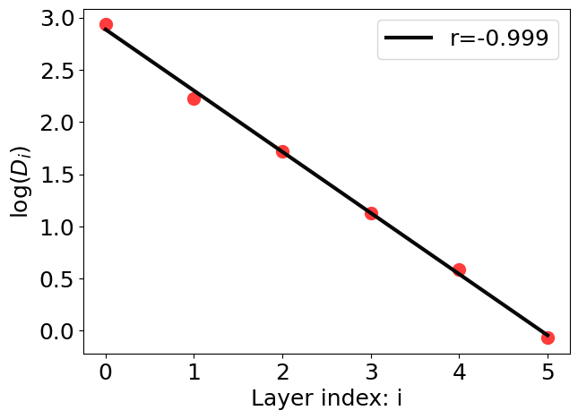
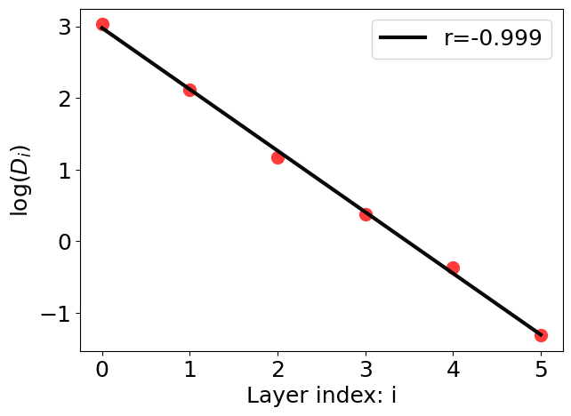
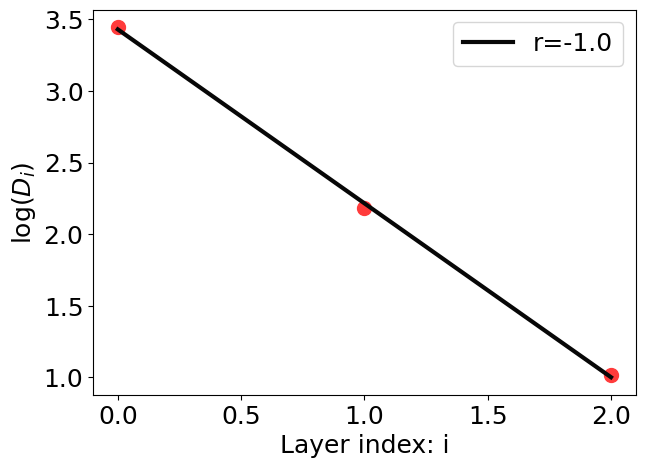
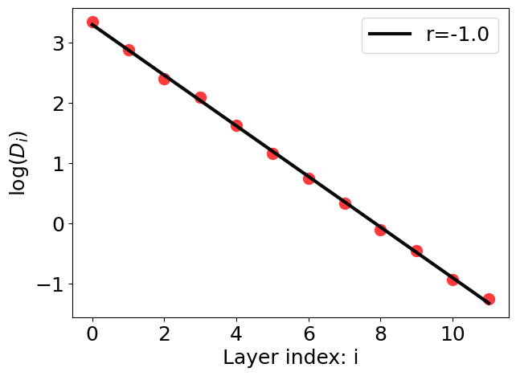
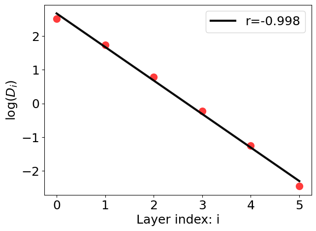
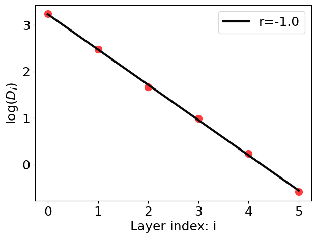
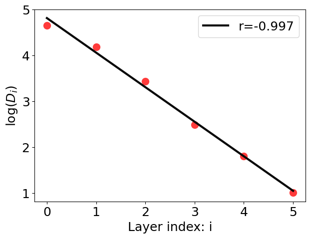
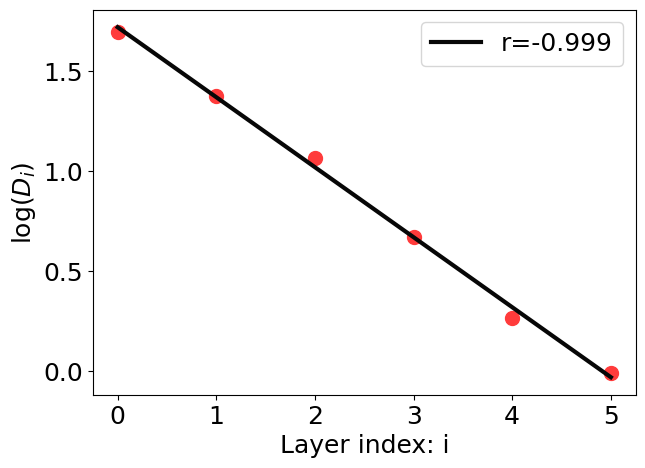
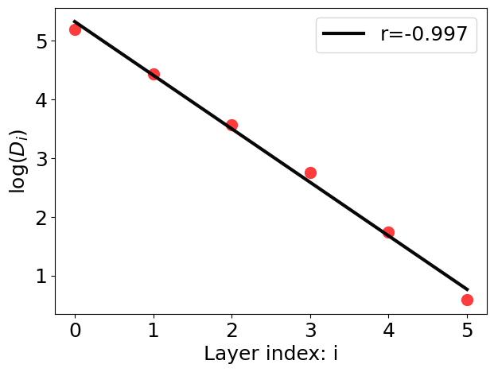

# Reimplementation of Equi-separation Law

This repo reimplements and tests the equi-separation law discovered in [A Law of Data Separation in Deep Learning](https://arxiv.org/abs/2210.17020).

The test varies across different datasets, data length, batch sizes, optimizers, learning rates, DNN depths, DNN widths, and dropout probabilities. The equi-separation law is consistently observed under various hyperparameters and network architectures.

`ESL` class provides an implementation of ESL(equi-separation law) for various datasets and supports customization of the deep neural network [detials](https://github.com/DaDaCheng/Re-equi-sepa/blob/main/src/esl.py).

## Quick start
```python
    from esl import ESL
    
    # Instantiate the ESL class with the MNIST dataset
    esl = ESL(dataset='MNIST', data_length=1000, batch_size=100, data_size=10)

    # Set the model architecture
    esl.set_model(hidden_dim=100, depth=6, p=0.05, device='cpu')

    # Train the model
    esl.train(lr=1e-3, num_epochs=100, stop_loss=1e-3, opt='Adam')

    # Compute the separation values
    logD_list = esl.compute_separation()

    # Plot the separation values
    esl.plot_separation(logD_list)
```



[colab quick start](https://colab.research.google.com/drive/1Ld6-qtoXlMhITrsTiYs2T7LzzeND4Fc0?usp=sharing).

## More results

| Results | Dataset | Data length | Batch size | Optimizer | Learning rate | DNN depth | DNN width | Dropout probability |
|------------------|--------|--------|--------|--------|--------|--------|--------|--------|
|  | MNIST   | 1000 | 50     | Adam   |1e-3    |6 |100|0|
|  | MNIST   | 10000 | 50     | Adam   |1e-3    |6 |100|0|
|  | MNIST   | 1000 | 100    | SGD    |1e-2    |6 |100|0.1|
|  | FashionMNIST   | 1000 | 100     | Adam   |1e-3    |3 |100|0.05|
|  | FashionMNIST   | 1000 | 100     | Adam   |5e-4    |12 |100|0|
|  | FashionMNIST   | 100 | 100     | Adam   |1e-3    |6 |100|0.1|
|  | FashionMNIST   | 1000 | 100   | Adam   |1e-4    |6 |900|0|
|  | FakeData   | 1000 | 50     | Adam   |1e-3    |6 |100|0|
|  | FakeData   | 1000 | 50     | Adam   |1e-3    |6 |1600|0.1|
| | CIFAR10   | 1000 | 100     | Adam   |1e-3    |6 |100|0|

In above plots, `r` represents Pearson correlation coefficient.

## Colab

[Stable version](https://colab.research.google.com/drive/1Ld6-qtoXlMhITrsTiYs2T7LzzeND4Fc0?usp=sharing).

[Neural Collapse](https://colab.research.google.com/drive/1ggVhDlMjLe7eV3Xj4nRMAbjteqCdOifX?usp=sharing).

