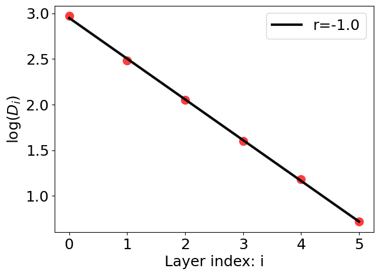

# Reimplementation of Equi-separation Law

This repo reimplements and tests the equi-separation law discovered in [A Law of Data Separation in Deep Learning](https://arxiv.org/abs/2210.17020).

The test varies across different datasets, data sizes, batch sizes, optimizers, learning rates, DNN depths, DNN widths, and dropout probabilities. The equi-separation law is consistently observed under various hyperparameters and network architectures.

# Results

| Results | Dataset | Data size | Batch size | Optimizer | Learning  rate | DNN depth | DNN width | Dropout probability |
|------------------|--------|--------|--------|--------|--------|--------|--------|--------|
|  | MNIST   | 1000 | 50     | Adam   |1e-3    |6 |100|0|
|  | MNIST   | 10000 | 50     | Adam   |1e-3    |6 |100|0|
|  | MNIST   | 1000 | 100    | SGD    |1e-2    |6 |100|0.1|
|  | FashionMNIST   | 1000 | 100     | Adam   |1e-3    |3 |100|0.05|
|  | FashionMNIST   | 1000 | 100     | Adam   |5e-4    |12 |100|0|
|  | FashionMNIST   | 100 | 100     | Adam   |1e-3    |6 |100|0.1|
|  | FashionMNIST   | 1000 | 100   | Adam   |1e-4    |6 |900|0|
|  | FakeData   | 1000 | 50     | Adam   |1e-3    |6 |100|0|
|  | FakeData   | 1000 | 50     | Adam   |1e-3    |6 |1600|0.1|
| | CIFAR10   | 1000 | 100     | Adam   |1e-3    |6 |100|0|

In above plots, `r` represents Pearson correlation coefficient.

# Colab
[Colab fast test](https://colab.research.google.com/drive/1ggVhDlMjLe7eV3Xj4nRMAbjteqCdOifX?usp=sharing).

